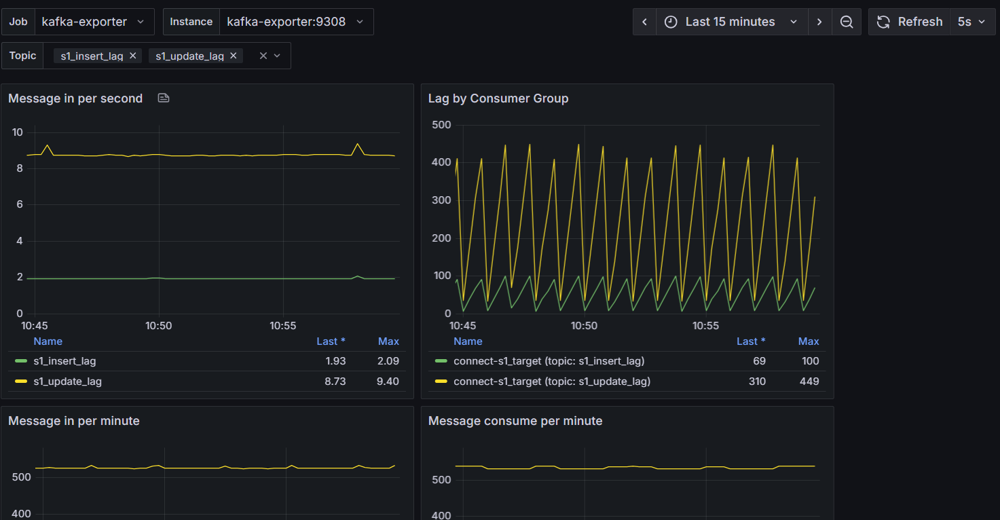
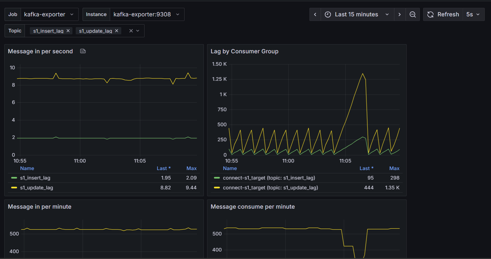

# SQLServer 2022 to SQLServer 2022

data flow with SQLServer 2022 as source connector and SQLServer 2022  as sink connector examples.

[<< Back to Root](../README.md)

---

### Specifications

  SQLServer version 2022
  FROM mcr.microsoft.com/mssql/server:2022-latest

---

## Topology & Architecture Design


### 1. Synchronize Topology

```
                +-----------------+
                |                 |
                |    SQLServer    |
                |      2022       |
                +---------+-------+
                          |
                          |
                          |
          +---------------v------------------+
          |                                  |
          |           Kafka Connect          |
          | (Debezium, JDBC connectors, etc) |
          |                                  |
          +---------------+------------------+
                          |
                          |
                          |
                          |
                  +-------v--------+
                  |                |
                  |   SQLServer    |
                  |      2022      |
                  +----------------+


```

We are using Docker Compose to deploy following components
* SQLServer
* Kafka
  * ZooKeeper
  * Kafka Broker
  * Kafka Connect with [Debezium](https://debezium.io/) and  [JDBC](https://debezium.io/documentation/reference/stable/connectors/jdbc.html) Connectors
* SQLServer

---

### 2. Real-time Monitoring Topology

```
+---------------------+        +---------------------+
|  Source SQL Server  |        |  Target SQL Server  |
|  (CDC enabled)      |        |  (Debezium sink)    |
+----------+----------+        +----------+----------+
           |                              ^
           |                              |
           v                              |
+---------------------+        +------------------------+
|   Debezium Connect  | -----> |     Kafka Broker       |
|  (JMX metrics open) |        |  (JMX + KafkaExporter) |
+---------------------+        +------------------------+
                |                       |
                +-----> Prometheus <----+
                            |
                            v
                        Grafana
```

##### 🧭 Real-time Monitoring Goal

Add real-time monitoring for:
* Kafka consumer lag
* Debezium connector lag
* SQL Server sync latency
* System health (Kafka, Connect, Zookeeper)

Using:
* Prometheus — metrics collector
* Grafana — visualization dashboard
* Kafka Exporter — exports consumer lag metrics
* JMX Exporter — exports JVM metrics from Kafka & Connect

---

### 3. Segregation Networking Simulation Base on Real World Case

```
           ┌──────────────┐
           │   Grafana    │
           └──────┬───────┘
                  │ {monitor_net}
           ┌──────┴─────────┐
           │  Prometheus    │
           └──────┬─────────┘
                  │
        ┌─────────┼───────────────┐
        │ kafka-exporter          │
        │ connect {bridges all}   │
        └──┬───────┬───────────┬──┘
           │       │           │
 {source_net}  {target_net}   {kafka_net}
      │            │           │
  source-db     target-db     kafka
      │                        │
 {sim_zone}             zookeeper, kafka-ui
      |
   sim-svc     
```

#### Logical Network Zone Design

| Zone         | Network | Purpose                    | Connected Components                                          |
| --------------- | -------------------------- | --------------------------| ------------------------------------------------------------- |
| 🧪 **Sim Zone**     | `sim_zone` | Simulator ↔ Source DB only | `sim-svc`, `source-db`                                        |
| 🛢️ **Source Zone**  | `source_zone` | Connect ↔ Source DB only   | `connect`, `source-db`                                        |
| 🎯 **Target Zone**  | `target_zone` | Connect ↔ Target DB only   | `connect`, `target-db`                                        |
| 🔗 **Kafka Zone**   | `kafka_zone` | Kafka stack                | `connect`, `zookeeper`, `kafka`, `kafka-ui`, `kafka-exporter` |
| 📈 **Monitor Zone** | `monitor_zone` | Monitoring stack           | `connect`, `prometheus`, `grafana`, `kafka-exporter`          |


#### Interconnection Rules

| Source                                     | Destination   | Network(s)                   | Description |
| ------------------------------------------ | ------------- | ---------------------------- | ----------- |
| `sim-svc` → `source-db`                    | `sim_zone`  | For insert/update simulation |             |
| `connect` → `source-db`                    | `source_zone`  | CDC source                   |             |
| `connect` → `target-db`                    | `target_zone`  | JDBC sink                    |             |
| `connect` → `kafka`                        | `kafka_zone`   | Message transport            |             |
| `connect` → `prometheus` (metrics scrape)  | `monitor_zone` | Monitoring                   |             |
| `prometheus` → `kafka-exporter`, `connect` | `monitor_zone` | Metric sources               |             |
| `grafana` → `prometheus`                   | `monitor_zone` | Dashboard                    |             |


---

### Usage or Running The Simulation

All processed is almost automatically from creating container setup the connector until you can testing the flow you can only running single command and then you can follow the instruction.

#### Running

How to run:
```shell
  # Starting up
  ./start.sh

```

⌚ Just wait until all process is finished.


#### Stopping
How to stop:

```shell
# Stopping 
./stop.sh

```

---

### Monitoring The Simulation

Open in your web browser
* 👉 Grafana UI: http://localhost:3000
* (default login: admin / admin)
* then open **Dashboard** → open **Kafka Exporter Overview**
* set **Refresh Rate by 5s** for better observe
* set time range **Last 15 Minutes** for better observe
* select **Topic** for → `s1_insert_lag` and `s1_update_lag`
* then especially to observe the **Lag by Consumer Group**, you will see it continously spike and down chart, and that is expected.

You will hesitate why this architecture design feels like that, and you want to know why others simulation and test is **claim debezium sync is par of milliseconds**, you can have overview answer in [< ANSWER FOR DEBEZIUM SYNC IN MILLISECONDS >](./answer-for-dbz-in-ms.md)


## Simulating The Latency

This is our main primary test:
* Our simulation purpose here is to test whether our debezium stack layer is success or no to deliver our design synchronize process, even with loss package, but when the connection is available it will automatically deliver into our target databases.
* We will continously to observe in grafana dashboard section **Lag by Consumer Group**. 
* Our test will simulating loss package 100% for couple seconds.
* And we expected that the chart in our monitoring grafana dashboard will be spike abnormally when the simulation of package loss 100% is begin.
* Then we expected to see that in our monitoring grafana dashboard will decrease normally when the simulation latency is reset.


#### Normal **Lag by Consumer Group** Chart



### Simulating The Package Loss
We will try to simulate lost connection into our target database
```shell
  ./simulate-latency target-db loss100
```

***And then We wait for approximately 30 seconds***

then execute this:
```shell
  ./simulate-latency target-db reset
```

#### Anomaly of **Lag by Consumer Group** Chart



**We see that there was anomaly spike of consumer lag chart, that is because the sink connector is failed to connect into our target database. As our expected to this simulation**


**Then it will decrease normaly as the connection is available again**


[<< Back to Root](../README.md)